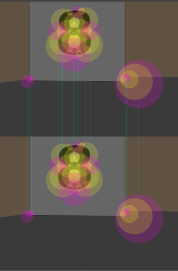

# my-robot

This is a simple robot to be used in Gazebo. Built using the urdf format.

It has two wheels with joints and two sensors.

* Camera
* Lidar

When launching it will also display RViz to see what the sensors are reading.

## Usage

### To launch the robot model in its world

`catkin_make`

`source devel/setup.bash`

`roslaunch my_robot world.launch`

### To follow a white ball with the Camera

* Dependencies

Download the following catkin package:

[https://github.com/danibyay/ball_chaser](https://github.com/danibyay/ball_chaser)

Compile with `catkin_make`.

In a separate console, source the setup.bash again and run the ball chaser module like so:

`roslaunch ball_chaser ball_chaser.launch`

* How to use it

In the Gazebo window, select > Insert > my_ball and place the ball where the robot's camera can see it. The robot should drive towards it.

Repeat the process by selecting the ball and removing it from the world with the Delete key. Place it again in a different direction for the robot to follow it.

### Localisation

The Adaptive Monte Carlo Localization ROS module is used (amcl) together with a map to localize the robot model.

* Dependencies

ROS teleop: [https://github.com/ros-teleop/teleop_twist_keyboard](https://github.com/ros-teleop/teleop_twist_keyboard)

* Launch command

Type this command in a separate console from where the world was launched.

This should enable you to see the map in RViz.

`roslaunch my_robot amcl.launch`

* Operation

Type this command in a separate console.

`rosrun teleop_twist_keyboard teleop_twist_keyboard.py`

Use the commands of teleop shown in the console to move the robot around, and watch in RViz how the arrows are pointing to where amcl thinks the robot is.

### Mapping

With the ROS package rtabmap_ros, by running:

`roslaunch my_robot mapping.launch`

You can manually navigate the robot with teleop around the world and a map will be generated and saved into my_robot/maps/*rtabmap.db*.

This is done thanks to the SLAM algorithm implemented with the laser sensor and the RGB-D camera.

An example of a 3d and 2d Map database was generated and is available on the following [link](https://drive.google.com/open?id=17e9LTf1pOaFlWJcLHDnNRBaxhiwc3kOz) due to size restrictions.

*Map results*

